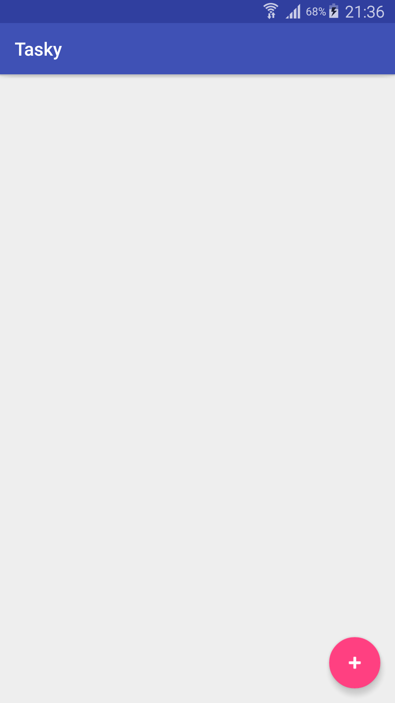
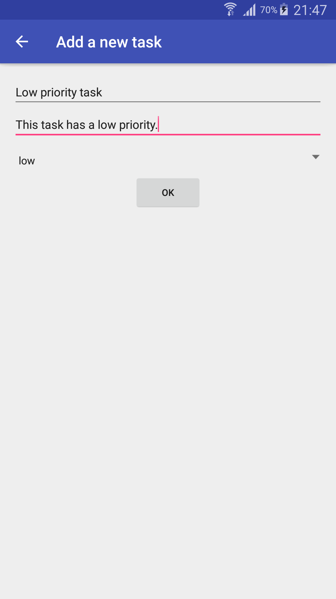
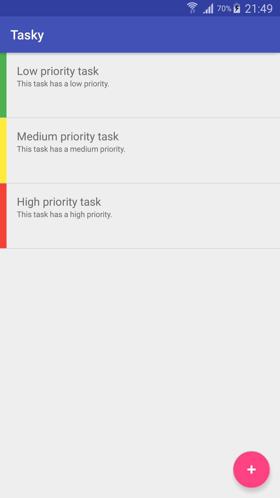
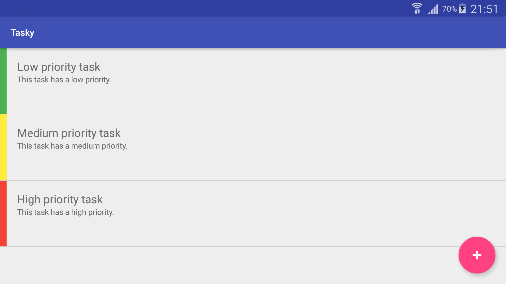

# Homework: Tasky

### The assignment and problems encountered

The task of this assignment was to create an application which uses Android's built-in database system to store user notes, in the manner of a to-do list. It should allow the user to create notes, view them as a list and delete notes which are no longer needed.

### Utilised snippets/solutions/libraries/SO answers

* https://stackoverflow.com/questions/25418229/creating-colored-stripes-in-android-listview [colored stripes]
* https://stackoverflow.com/questions/7378636/setting-background-colour-of-android-layout-element
* https://material.io/guidelines/style/color.html
* https://material.io/guidelines/layout/metrics-keylines.html
* https://jeroenmols.com/blog/2016/03/07/resourcenaming/ [XML resource naming convention, previously referenced in the [Unit Converter](https://github.com/skomaromi/unit-converter) README]
* https://softwareengineering.stackexchange.com/questions/201777/break-on-default-case-in-switch
* https://stackoverflow.com/questions/6393487/how-can-i-show-ellipses-on-my-textview-if-it-is-greater-than-the-1-line
* https://stackoverflow.com/questions/44109700/how-to-make-primary-key-as-autoincrement-for-room-persistence-lib
* https://stackoverflow.com/questions/6029495/how-can-i-generate-random-number-in-specific-range-in-android
* https://stackoverflow.com/questions/10407159/how-to-manage-startactivityforresult-on-android
* https://stackoverflow.com/questions/26963365/how-to-create-a-click-animation-for-items-in-a-recycleview
* https://stackoverflow.com/questions/10978038/restrict-edittext-to-single-line

### Screenshots

Samsung Galaxy Note 3 (SM-N900) running Lollipop (5.0)

    

### Bottom line
While this application does function as a basic application for creating to-do lists, a potential improvement would be to add a new Activity or reuse the existing TaskAddActivity so that each to-do entry could be individually viewed and eventually edited. Also, handling the empty state, shown in the first screenshot, in an aesthetically pleasing way would noticeably improve the general impression.
